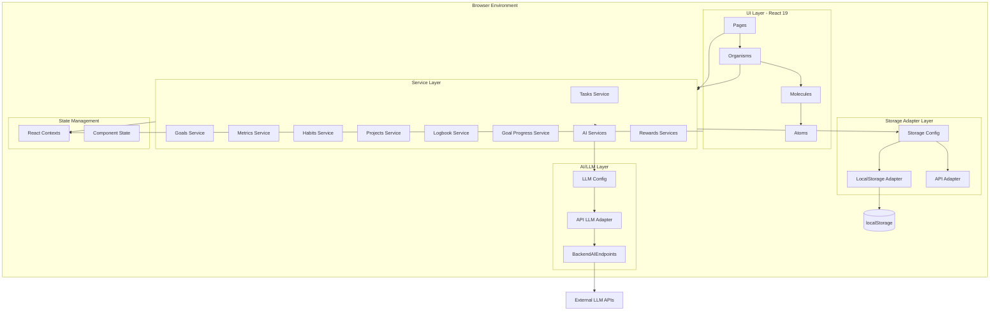

# Personal OS - Architecture Overview

**Status Note (2026-01):** This document is partially outdated. For current system entrypoints and architecture, start with `CLAUDE.md`.

**Analysis Date:** January 10, 2026  
**System Version:** Portfolio Site with Growth System (Personal OS)  
**Status:** Production-Ready with 15 Completed Implementation Runs

---

## Table of Contents

1. [Introduction](#introduction)
2. [System Overview](#system-overview)
3. [Architecture Diagram](#architecture-diagram)
4. [Domain Model & Data Layer](#domain-model--data-layer)
5. [Service Layer Architecture](#service-layer-architecture)
6. [UI Component Architecture](#ui-component-architecture)
7. [AI Integration Layer](#ai-integration-layer)
8. [Cross-Cutting Concerns](#cross-cutting-concerns)
9. [Key User Flows](#key-user-flows)
10. [Tech Stack & Dependencies](#tech-stack--dependencies)
11. [Quick Start Guide](#quick-start-guide)

---

## Introduction

**Personal OS** is a comprehensive AI-powered personal growth and productivity system built as a React single-page application. It functions as a "second brain" that helps users manage tasks, track habits, set goals, monitor metrics, maintain a reflective logbook, and organize knowledge—all enhanced by 33 AI-powered features distributed across all entity types.

The system was built incrementally over 15 "strafing runs" (documented in [`GROWTH_SYSTEM_PLAN.md`](./GROWTH_SYSTEM_PLAN.md)), each adding foundational types, UI components, service layers, and AI enhancements. The result is a production-grade system with backend-backed auth and AI, and a frontend architecture that is ready for API-driven persistence.

### Key Characteristics

- **Backend for Auth + AI**: Cognito-backed auth and `/ai/*` endpoints power LLM features
- **AI-First Design**: 33 LLM-powered features integrated into every workflow
- **Atomic Design**: Organized component hierarchy (atoms → molecules → organisms → templates → pages)
- **TypeScript-Strict**: Complete type safety with Zod schemas for AI interactions
- **Gamified**: Points, rewards, and milestones for motivation
- **Dual-Mode**: Work mode (focused productivity) and Leisure mode (media, hobbies, reflection)

---

## System Overview

Personal OS consists of three major subsystems:

### 1. Growth System (Core)

The primary productivity layer with six interconnected entity types:

- **Tasks**: Actionable items with Kanban/List/Calendar views, dependencies, recurring tasks, and points-based completion rewards
- **Projects**: Multi-task containers with health analysis, risk assessment, and timeline tracking
- **Goals**: Hierarchical goal setting with time horizons (Yearly → Daily), success criteria tracking, and multi-source progress calculation
- **Metrics**: Quantitative tracking with trend analysis, heatmaps, anomaly detection, predictions, and milestone rewards
- **Habits**: Daily/weekly habit tracking with streak monitoring, habit loop design (trigger-action-reward), and calendar heatmaps
- **Logbook**: Daily journaling with mood/energy tracking, AI-generated reflection prompts, and entity linking

### 2. Knowledge Vault

A learning management subsystem featuring:

- **Library**: Document storage and retrieval
- **Courses**: AI-generated courses with lessons and progress tracking
- **Skill Tree**: Visual skill progression and dependencies
- **Flashcards**: Spaced repetition system
- **Concept Collider**: Creative synthesis of ideas

### 3. Rewards & Gamification

A motivation layer including:

- **Wallet System**: Points earned from task completion and metric milestones
- **Rewards Store**: Purchasable rewards with point costs
- **Reward Studio**: Custom reward creation
- **Media Backlog & Hobby Quests**: Leisure-mode features for entertainment and personal interests

---

## Architecture Diagram



---

## Domain Model & Data Layer

### Core Entity Types

The system is built around six primary entities defined in [`src/types/growth-system.ts`](../src/types/growth-system.ts):

#### 1. Task

```typescript
interface Task {
  id: string;
  title: string;
  description: string | null;
  area: Area; // Health | Wealth | Love | Happiness | Operations | DayJob
  priority: Priority; // P1 | P2 | P3 | P4
  status: TaskStatus; // NotStarted | InProgress | Blocked | OnHold | Done | Cancelled
  size: number | null; // Estimated minutes
  dueDate: string | null;
  scheduledDate: string | null;
  isRecurring: boolean;
  pointValue: number | null;
  // ... timestamps and relationships
}
```

**Key Features:**

- Dependencies between tasks
- Project and Goal associations
- Recurring task support
- Point-based rewards on completion

#### 2. Project

```typescript
interface Project {
  id: string;
  name: string;
  area: Area;
  status: ProjectStatus; // Planning | Active | OnHold | Completed | Cancelled
  impact: number; // 1-5 scale
  startDate: string | null;
  endDate: string | null;
  // ... linked tasks and goals
}
```

#### 3. Goal

```typescript
interface Goal {
  id: string;
  title: string;
  area: Area;
  timeHorizon: TimeHorizon; // Yearly | Quarterly | Monthly | Weekly | Daily
  status: GoalStatus; // Planning | Active | OnTrack | AtRisk | Achieved | Abandoned
  successCriteria: SuccessCriterion[]; // Enhanced with completion tracking
  progressConfig: GoalProgressConfig | null; // Weighted progress calculation
  parentGoalId: string | null; // Goal hierarchy
  // ... relationships to tasks, metrics, habits, projects
}
```

**Key Innovation:**

- **Multi-Source Progress Calculation**: Goals track progress from:
  - Completed success criteria (40% weight by default)
  - Linked completed tasks (30% weight)
  - Linked metrics at target (20% weight)
  - Linked habit consistency (10% weight)
- **Hierarchical Goals**: Goals can cascade (e.g., Yearly → Quarterly → Monthly)

#### 4. Metric

```typescript
interface Metric {
  id: string;
  name: string;
  area: Area;
  unit: MetricUnit; // count | hours | dollars | kg | percent | etc.
  direction: MetricDirection; // Higher | Lower | Target
  targetValue: number | null;
  source: MetricSource; // Manual | App | Device
  // ... logs tracked separately
}
```

**Supporting Types:**

- `MetricLog`: Individual data points with value, notes, timestamp
- `MetricInsight`: Cached AI-generated insights (patterns, anomalies, predictions)
- `MetricMilestone`: Achievements like target reached, streak milestones

#### 5. Habit

```typescript
interface Habit {
  id: string;
  name: string;
  area: Area;
  habitType: HabitType; // Build | Maintain | Reduce | Quit
  frequency: HabitFrequency; // Daily | Weekly | Monthly
  // Habit Loop Design
  trigger: string | null;
  action: string | null;
  reward: string | null;
  frictionUp: string | null; // Make harder (for bad habits)
  frictionDown: string | null; // Make easier (for good habits)
  // ... logs tracked separately
}
```

#### 6. Logbook Entry

```typescript
interface LogbookEntry {
  id: string;
  date: string;
  title: string | null;
  notes: string | null;
  mood: LogbookMood | null; // Low | Steady | High
  energy: number | null; // 1-10 scale
  // ... can link to tasks, goals, habits, projects
}
```

### Enums & Shared Types

All entities share common enums:

- **Area**: `Health | Wealth | Love | Happiness | Operations | DayJob`
- **SubCategory**: Granular categorization within each Area (e.g., Physical, Mental, Income, Expenses)
- **Priority**: `P1 | P2 | P3 | P4` (P1 = highest)

### Relationships

Entities are interconnected via relational tables:

- `TaskDependency`: Task → Task (blocking relationships)
- `TaskProject`, `TaskGoal`: Many-to-many task associations
- `ProjectGoal`, `GoalMetric`, `HabitGoal`: Cross-entity links
- `LogbookTask`, `LogbookGoal`, etc.: Journal entry references

### Storage Adapter Pattern

All data persistence goes through an abstraction layer ([`src/lib/storage`](../src/lib/storage)):

```typescript
interface IStorageAdapter {
  getAll<T>(collection: string): Promise<T[]>;
  getById<T>(collection: string, id: string): Promise<T | null>;
  create<T>(collection: string, id: string, entity: T): Promise<T>;
  update<T>(collection: string, id: string, updates: Partial<T>): Promise<T | null>;
  delete(collection: string, id: string): Promise<boolean>;
  // ... relation methods
}
```

**Implementations:**

1. **LocalStorageAdapter** (default): Persists to browser localStorage with `gs_` prefix
2. **APIStorageAdapter** (future-ready): Can point to a real backend

The system can switch between adapters via `storageConfig.setStorageType('local' | 'api')`.

---

## Service Layer Architecture

All business logic resides in service modules under [`src/services/growth-system/`](../src/services/growth-system/):

### Core Entity Services

Each entity has a dedicated service with consistent patterns:

**Example: Tasks Service** ([`tasks.service.ts`](../src/services/growth-system/tasks.service.ts))

```typescript
export const tasksService = {
  async getAll(filters?: FilterOptions): Promise<PaginatedResponse<Task>>;
  async getById(id: string): Promise<ApiResponse<Task>>;
  async create(input: CreateTaskInput): Promise<ApiResponse<Task>>;
  async update(id: string, input: UpdateTaskInput): Promise<ApiResponse<Task>>;
  async delete(id: string): Promise<ApiResponse<void>>;

  // Relationship methods
  async addDependency(taskId: string, dependsOnTaskId: string): Promise<ApiResponse<TaskDependency>>;
  async removeDependency(dependencyId: string): Promise<ApiResponse<void>>;
  async getDependencies(taskId: string): Promise<ApiResponse<TaskDependency[]>>;

  // Advanced queries
  async getBlockedTasks(taskId: string): Promise<Task[]>;
  async getDependencyGraph(): Promise<DependencyGraph>;
}
```

**Similar Services:**

- `goals.service.ts`: CRUD + linked entities + progress queries
- `metrics.service.ts`: CRUD + log history + milestone tracking
- `habits.service.ts`: CRUD + completion logs + streak calculation
- `projects.service.ts`: CRUD + linked tasks + health status
- `logbook.service.ts`: CRUD + entity linking

### Specialized Services

#### Goal Progress Service

[`goal-progress.service.ts`](../src/services/growth-system/goal-progress.service.ts) - Calculates multi-source progress:

```typescript
export const goalProgressService = {
  async computeProgress(goalId: string): Promise<GoalProgressBreakdown>;
  calculateCriteriaProgress(criteria: SuccessCriterion[]): ProgressMetrics;
  calculateTasksProgress(tasks: Task[]): ProgressMetrics;
  calculateMetricsProgress(metricIds: string[]): Promise<ProgressMetrics>;
  calculateHabitsProgress(habits: Habit[]): Promise<ProgressMetrics>;
  async calculateHealth(goal: Goal, progress: GoalProgressBreakdown): Promise<GoalHealthData>;
}
```

This service aggregates progress from:

1. Completed success criteria (checkboxes)
2. Completed linked tasks
3. Linked metrics at target thresholds
4. Linked habit streaks/consistency

#### Metric AI Services

Three specialized AI services for metrics ([`metric-ai.service.ts`](../src/services/growth-system/metric-ai.service.ts), [`metric-insights.service.ts`](../src/services/growth-system/metric-insights.service.ts), [`metric-predictions.service.ts`](../src/services/growth-system/metric-predictions.service.ts)):

- **Pattern Recognition**: Detects trends, cycles, plateaus
- **Anomaly Detection**: Flags unusual data points
- **Correlations**: Discovers relationships between metrics
- **Predictions**: Forecasts future values using trend analysis
- **Insights Caching**: Stores expensive AI computations with expiration

#### Rewards & Points Services

[`point-calculator.service.ts`](../src/services/rewards/point-calculator.service.ts) - Gamification layer:

```typescript
export const pointCalculatorService = {
  calculateTaskPoints(task: Task): TaskPointValuation;
  calculateMetricMilestonePoints(milestoneType, value, targetValue?): number;
  // Multipliers: Priority (P1=2x), Area (Health=1.3x), Size (>120min=1.5x)
}
```

Earned points stored in wallet, spendable in Rewards Store.

### Service Design Patterns

All services follow these patterns:

1. **Mock Delays**: `await randomDelay(100, 500)` simulates network latency
2. **Consistent API Shape**: `ApiResponse<T> = { data?: T; success: boolean; error?: { message, code } }`
3. **Filter/Sort/Pagination**: Shared `FilterOptions` type applied client-side
4. **Relationship Cascade**: Deleting entities cleans up orphaned relations
5. **ID Generation**: `generateId()` creates unique timestamped IDs

---

## UI Component Architecture

Personal OS follows **Atomic Design** principles with a strict component hierarchy:

### Component Layers

```
src/components/
├── atoms/          # Primitive UI elements (14 components)
├── molecules/      # Simple combinations (67 components)
├── organisms/      # Complex sections (49 components)
├── templates/      # Page layouts (2 layouts)
└── pages/          # Route components (28 pages)
```

### Atoms (Primitives)

Smallest reusable UI elements ([`src/components/atoms/`](../src/components/atoms/)):

- **Button**: Primary/secondary/danger variants with loading states
- **AreaBadge**: Color-coded pills for Areas (Health, Wealth, etc.)
- **PriorityIndicator**: P1-P4 visual badges
- **StatusBadge**: Contextual status displays with colors
- **ProgressRing**: Animated circular progress (uses Framer Motion)
- **DateDisplay**: Smart date formatting with "overdue" warnings
- **EntityLinkChip**: Clickable navigation chips
- **DependencyBadge**: "Blocked by" / "Blocking" indicators
- **AIThinkingIndicator**: Animated AI processing state
- **AIConfidenceIndicator**: Confidence level display (0-100%)
- **CelebrationEffect**: Confetti animation for achievements

### Molecules (Simple Combinations)

Single-responsibility composable components:

**Entity Display Cards:**

- `TaskListItem`, `GoalCard`, `MetricCard`, `HabitCard`, `ProjectCard`, `LogbookEntryCard`
- Each card shows summary info, status, progress, and quick actions

**Specialized UI:**

- `FilterPanel`: Collapsible sidebar with multi-select filters
- `QuickFilterBar`: Horizontal button group for preset filters
- `BulkActionsBar`: Floating action bar when items selected
- `EmptyState`: Contextual empty states with CTAs
- `MetricSparkline`: Inline trend chart (uses Recharts under the hood)
- `MetricProgressRing`: Circular metric progress with target line
- `HabitCalendarHeatmap`: GitHub-style contribution calendar
- `SuccessCriteriaList`: Sortable/editable checklist for goals
- `LinkedGoalsDisplay`: Shows goal associations with navigation

**AI Assist Panels:**

- `AITaskAssistPanel`, `AIGoalAssistPanel`, `AIMetricAssistPanel`, etc.
- Slide-over panels with mode selection (7-9 modes per entity type)

### Organisms (Complex Sections)

Multi-molecule components with complex behavior:

**View Components:**

- **TaskKanbanBoard**: Drag-and-drop board with status columns
- **TaskCalendarView**: Full calendar with task scheduling
- **GoalKanbanView**: Goal board grouped by status
- **GoalTimelineView**: Horizontal timeline grouped by time horizon
- **GoalHierarchicalTimeView**: Tree + timeline hybrid view
- **HabitCalendarView**: Monthly habit completion tracker
- **MetricDetailTabs**: 7-tab metric detail view (Overview, Trends, Patterns, Correlations, Predictions, Goals, History)

**Form Components:**

- `TaskCreateForm`, `TaskEditPanel`: Create/edit with full validation
- `GoalCreateForm`, `GoalEditForm`: Success criteria editor, time horizon picker
- `MetricCreateForm`, `MetricEditForm`: Unit selector, target configuration
- `HabitCreateForm`, `HabitEditForm`: Habit loop designer
- `LogbookEditor`: Rich text editor with mood/energy sliders

**Specialized Organisms:**

- **CommandPalette**: Global Cmd+K search across all entities
- **Dialog**: Reusable modal with slide-over variants
- **RelationshipPicker**: Multi-select modal for linking entities
- **DependencyGraph**: SVG-based task dependency visualization
- **AIAssistPanel**: Generic AI panel with provider selection
- **GoalDetailView**: Full goal detail with tabs, progress breakdown, linked entities
- **MetricMilestoneSystem**: Milestone tracking with rewards integration

### Templates (Layouts)

- **AdminLayout** ([`AdminLayout.tsx`](../src/components/templates/AdminLayout.tsx)): Authenticated area with:
  - Resizable sidebar (240-480px, persisted to localStorage)
  - Hierarchical navigation (Work mode vs Leisure mode)
  - Global command palette trigger (Cmd+K)
  - Wallet widget display
  - Mode toggle (Work ↔ Leisure)
  - Theme toggle (Light ↔ Dark)
- **MainLayout**: Public portfolio site wrapper (header, footer)

### Pages (Route Components)

28 page components under [`src/pages/admin/`](../src/pages/admin/):

**Growth System Pages:**

- `TasksPage`: List/Kanban/Calendar/Graph views with filters
- `GoalsPage`: Vision board with 4 view modes (Time Horizon, Area, Kanban, Timeline)
- `MetricsPage`: Metric dashboard with grouping, quick logging, detail modals
- `HabitsPage`: Today-focused tracker with calendar heatmap
- `ProjectsPage`: Project cards with health indicators
- `LogbookPage`: Daily journal entries with mood tracking
- `DashboardPage`: Overview widgets, AI insights, daily planning assistant
- `WeeklyReviewPage`: 3-step guided weekly review with AI insights

**Knowledge Vault Pages:**

- `KnowledgeVaultPage`, `CoursesPage`, `CourseDetailPage`, `SkillTreePage`, `FlashcardsPage`, `ConceptColliderPage`

**Rewards & Leisure Pages:**

- `RewardsStorePage`, `RewardStudioPage`, `MediaBacklogPage`, `HobbyQuestsPage`

**Supporting Pages:**

- `SettingsPage`: AI provider config, feature assignment, wallet management
- `ChatbotPage`: Conversational AI assistant
- `ComponentsDemoPage`: Component showcase for development

### Key UI Patterns

#### 1. Loading States

All async operations show skeleton loaders or spinner states.

#### 2. Empty States

Contextual empty states with illustrations and CTAs (e.g., "No tasks yet. Create your first task!")

#### 3. Error Handling

Error boundaries catch crashes, inline error messages for failed operations.

#### 4. Responsive Design

Mobile-first with breakpoints: `sm:` (640px), `md:` (768px), `lg:` (1024px), `xl:` (1280px)

#### 5. Dark Mode

All components support dark mode via Tailwind's `dark:` variant, toggled via `ThemeToggle` atom.

#### 6. Accessibility

- Semantic HTML (proper headings, landmarks)
- Keyboard navigation (Tab, Enter, Escape)
- ARIA labels on interactive elements
- Focus management in modals

---

## AI Integration Layer

Personal OS includes **33 AI-powered features** distributed across all entity types, powered by a flexible multi-provider LLM system.

### AI Architecture

Frontend uses an API-first LLM adapter and delegates provider calls to the backend `/ai/*` endpoints. The frontend side lives in [`src/lib/llm/`](../src/lib/llm/) and focuses on schemas, config selection, and API wiring.

```
src/lib/llm/
├── llm-config.ts             # API-only adapter selection
├── api-llm-adapter.ts        # Calls /ai/* endpoints
├── config/
│   ├── feature-types.ts      # 33 AIFeature types
│   ├── feature-config-store.ts  # Per-feature provider assignments
│   ├── provider-types.ts     # Provider list + labels
│   └── model-catalog.ts      # Provider model catalog
├── schemas/
│   ├── task-schemas.ts       # Zod schemas for task AI outputs
│   ├── goal-ai-schemas.ts    # Goal AI structured outputs
│   ├── project-schemas.ts
│   ├── metric-schemas.ts
│   └── habit-schemas.ts
└── llm-prompts.ts            # Prompt templates (frontend helpers)
```

### Supported Providers

Seven LLM providers with model selection:

1. **Anthropic**: Claude 3.5 Sonnet, Claude 3.5 Haiku (default for most features)
2. **OpenAI**: GPT-4o, GPT-4o-mini
3. **Google**: Gemini 1.5 Pro, Gemini 1.5 Flash
4. **Groq**: Llama 3.3 70B, Llama 3.1 8B (fast inference)
5. **xAI**: Grok (experimental)
6. **DeepSeek**: DeepSeek models
7. **Cerebras**: Ultra-fast inference

### 33 AI Features

AI features are categorized by entity type:

#### Tasks (7 features)

1. `parseTask`: Natural language → structured task
2. `breakdownTask`: Decompose complex task into subtasks
3. `priorityAdvisor`: Suggest priority based on context
4. `effortEstimation`: Estimate time/effort required
5. `taskCategorization`: Auto-assign area/subcategory
6. `dependencyDetection`: Identify task dependencies
7. Blocker resolution (part of `dependencyDetection`)

#### Projects (3 features)

8. `projectHealth`: Assess project health (green/yellow/red)
9. `projectTaskGen`: Generate comprehensive task breakdown
10. `projectRisk`: Identify project risks

#### Goals (7 features)

11. `goalRefinement`: Improve goal clarity/specificity
12. `successCriteriaGen`: Generate measurable success criteria
13. `metricSuggestions`: Recommend metrics to track
14. `goalCascade`: Break yearly goals → quarterly → monthly
15. `achievementForecast`: Predict likelihood of completion
16. `goalConflict`: Detect conflicting goals
17. `goalProgress`: Analyze progress trajectory

#### Metrics (6 features)

18. `metricPatterns`: Identify trends, cycles, plateaus
19. `metricAnomalies`: Flag unusual data points
20. `metricCorrelations`: Discover metric relationships
21. `metricTargets`: Suggest appropriate targets
22. `metricHealth`: Assess tracking consistency

#### Habits (6 features)

23. `habitDesign`: Optimize trigger-action-reward loop
24. `habitStack`: Suggest habit combinations (habit stacking)
25. `streakRecovery`: Get back on track after missed days
26. `habitPatterns`: Understand completion patterns
27. `triggerOptimization`: Improve habit cues
28. `habitGoalAlignment`: Check alignment with goals

#### Logbook (6 features)

29. `reflectionPrompts`: Generate thoughtful journaling questions
30. `dailyDigest`: Summarize day's activities
31. `logbookPatterns`: Discover patterns in journaling
32. `sentimentAnalysis`: Analyze emotional trends
33. `weeklyReview`: Generate comprehensive weekly summaries
34. `connectionSuggestions`: Link entries to entities

### Feature Configuration

Users configure AI features in Settings via backend-backed endpoints:

1. **Provider keys** are stored in backend infrastructure (Secrets Manager)
2. **Assign Provider to Feature**: Each of 33 features can use different providers
3. **Cost-Optimized Mix**: Preset configuration using cheaper models for simple tasks

Example configuration:

```typescript
{
  parseTask: { provider: 'anthropic', model: 'claude-3-5-haiku-20241022' },  // Fast, cheap
  breakdownTask: { provider: 'anthropic', model: 'claude-3-5-sonnet-20241022' },  // Smart
  effortEstimation: { provider: 'groq', model: 'llama-3.1-8b-instant' },  // Very fast
}
```

### Structured Output with Zod

All AI outputs use Zod schemas for type safety and validation:

**Example: Task Breakdown**

```typescript
export const TaskBreakdownOutputSchema = z.object({
  subtasks: z.array(
    z.object({
      title: z.string(),
      description: z.string(),
      estimatedSize: z.number().nullable(),
    })
  ),
  reasoning: z.string(),
});
```

The LLM adapter uses LangChain's `.withStructuredOutput(schema)` to enforce JSON schema compliance.

### AI UI Integration

**AI Assist Panels** (slide-overs) appear in entity detail views:

- **Mode Selector**: Dropdown to choose AI feature (e.g., "Refine Goal", "Generate Criteria")
- **Input Fields**: Context-specific inputs (e.g., paste goal text)
- **Thinking Indicator**: Animated loading state during API call
- **Confidence Display**: Shows AI confidence (0-100%)
- **Results Display**: Formatted output with "Accept" / "Dismiss" actions
- **Reasoning**: Expandable section explaining AI logic

**Example Flow:**

1. User opens Goal detail
2. Clicks "AI Goal Tools" button
3. Selects "Generate Success Criteria" mode
4. Clicks "Generate"
5. AI returns 5 measurable criteria with 92% confidence
6. User clicks "Accept" → criteria added to goal

### Fallback Behavior

If no API keys are configured in the backend, `/ai/*` endpoints return `LLM_NOT_CONFIGURED` errors (see `docs/backend/API_ENDPOINTS.md`).

---

## Cross-Cutting Concerns

### 1. Authentication & Authorization

**Cognito Auth System** ([`auth.service.ts`](../src/lib/auth/auth.service.ts), [`cognito-config.ts`](../src/lib/auth/cognito-config.ts)):

- Email/password login via AWS Amplify (Cognito)
- Tokens stored in localStorage (`gs_auth_tokens`), user cached in `gs_auth_user`
- Protected routes via `<ProtectedRoute>` wrapper
- `apiClient` attaches `Authorization: Bearer` and refreshes on 401

### 2. Theming & Dark Mode

**Theme System:**

- Tailwind CSS with `dark:` variant throughout
- Theme preference stored in localStorage
- `useTheme` hook toggles theme
- `ThemeToggle` atom in header

**Colors:**

- Light mode: Gray scale (50-900) with green accents
- Dark mode: Dark gray (800-950) with green accents
- Semantic colors: Blue (info), Yellow (warning), Red (danger), Green (success)

### 3. State Management

Minimal global state:

**React Contexts:**

- `AuthContext`: User auth state
- `ModeContext`: Work vs Leisure mode toggle
- `WalletContext`: Points balance
- `RewardsContext`: Rewards inventory
- `KnowledgeVaultContext`: Knowledge management state

**Local Component State:**

- Most pages use `useState` for UI state (loading, filters, selections)
- `useEffect` for data fetching
- No Redux/Zustand for entity data (services called directly)

### 4. Routing

**React Router v7** ([`src/App.tsx`](../src/App.tsx)):

```typescript
<Routes>
  <Route element={<MainLayout />}>
    <Route path="/" element={<HomePage />} />
    <Route path="/products" element={<ProductsPage />} />
  </Route>

  <Route path="/admin/login" element={<LoginPage />} />

  <Route path="/admin" element={<ProtectedRoute><AdminLayout /></ProtectedRoute>}>
    <Route path="dashboard" element={<DashboardPage />} />
    <Route path="tasks" element={<TasksPage />} />
    <Route path="goals" element={<GoalsPage />} />
    {/* ... 25 more admin routes */}
  </Route>
</Routes>
```

All routes defined in [`src/routes.ts`](../src/routes.ts) as constants for type safety.

### 5. Command Palette

**Global Search** (Cmd+K):

- `CommandPalette` organism
- Fuzzy search across all entities (tasks, goals, metrics, habits, projects, logbook)
- Keyboard navigation (Arrow keys, Enter, Escape)
- Quick actions: Create, View, Navigate
- Recent items prioritized

### 6. Rewards & Gamification

**Points System:**

- Tasks award points on completion (size × priority × area multipliers)
- Metric milestones award points (target reached, streaks)
- Points stored in wallet (`WalletContext`)
- Spendable in Rewards Store

**Point Calculation** ([`point-calculator.service.ts`](../src/services/rewards/point-calculator.service.ts)):

```
Base = size (minutes) × 10 points/min
Priority Multiplier: P1=2x, P2=1.5x, P3=1.2x, P4=1x
Area Multiplier: Health=1.3x, Wealth=1.2x, etc.
Size Bonus: >120min=1.5x, >60min=1.2x
```

### 7. Analytics & Utilities

Specialized utility modules ([`src/utils/`](../src/utils/)):

- `metric-analytics.ts`: Trend calculation, heatmap generation, predictions, anomaly detection
- `habit-analytics.ts`: Streak calculation, consistency scoring
- `metric-correlations.ts`: Pearson correlation between metrics
- `metric-grouping.ts`: Group metrics by area/status/momentum
- `goal-migration.ts`: Data migration helpers for schema updates
- `date-formatters.ts`: Relative dates ("3 days ago", "Overdue by 2 days")

### 8. Performance Optimizations

- **Code Splitting**: Route-based with React.lazy (future enhancement)
- **Memoization**: `useMemo` for expensive calculations (progress, filtering)
- **Debouncing**: Search inputs debounced 300ms
- **Pagination**: Large lists paginated (50 items default)
- **Lazy Loading**: Images use native lazy loading

---

## Key User Flows

### Flow 1: Create Task with AI Assistance

1. User navigates to `/admin/tasks`
2. Clicks "+ New Task"
3. Types natural language: "Review Q1 financial statements by next Friday"
4. Clicks "Parse with AI" button
5. AI extracts:
   - Title: "Review Q1 Financial Statements"
   - Area: Wealth
   - SubCategory: Income
   - Priority: P2
   - Due Date: (next Friday)
   - Size: 60 minutes
6. User reviews, adjusts, clicks "Create"
7. Task saved to localStorage
8. Points calculated and awarded on completion

### Flow 2: Track Goal Progress

1. User navigates to `/admin/goals`
2. Selects a goal (e.g., "Lose 10 pounds by June")
3. Goal detail view opens with tabs:
   - **Overview**: Progress ring (42% complete), health status (On Track)
   - **Progress Breakdown**:
     - Success Criteria: 2/5 completed (40%)
     - Linked Tasks: 8/12 completed (67%)
     - Linked Metrics: 2/3 at target (67%)
     - Linked Habits: 85% consistency
   - **Activity Timeline**: Criterion completed, task linked, metric logged
4. User clicks "AI Goal Tools" → "Forecast Achievement"
5. AI predicts: "87% likelihood of achieving by target date given current velocity"
6. User links new metric or adds criterion
7. Progress recalculated in real-time

### Flow 3: Log Metric & Earn Milestone

1. User navigates to `/admin/metrics`
2. Clicks "Quick Log" on "Daily Steps" metric
3. Enters value: 10,500 steps
4. Clicks "Save"
5. System detects target reached (10,000 steps)
6. Metric milestone created: "Target Reached"
7. Points awarded to wallet (200 points)
8. Celebration confetti animation triggers
9. Metric card updates with "🎯 Target Reached" badge

### Flow 4: Weekly Review with AI

1. User navigates to `/admin/weekly-review`
2. **Step 1: Review** - AI generates:
   - "Completed 18 tasks, 3 goals progressed"
   - "Top accomplishment: Launched new project"
   - "Pattern insight: Most productive on Tuesdays"
3. **Step 2: Plan** - AI suggests:
   - "Focus on 3 P1 tasks next week"
   - "At-risk goal needs attention"
   - "Consider adding recovery habit (low energy detected)"
4. **Step 3: Commit** - User selects top 3 priorities for next week
5. Review saved to logbook as weekly entry

---

## Tech Stack & Dependencies

### Core Framework

- **React 19.2.0**: UI library with latest features (automatic batching, transitions)
- **TypeScript 5.9**: Strict mode enabled for type safety
- **Vite 7.2**: Build tool and dev server (fast HMR)

### Routing & State

- **React Router 7.11**: Client-side routing
- **Zustand 5.0**: Lightweight state management (configured, minimally used)
- **TanStack Query 5.90**: Server state caching (configured, future-ready)

### Styling

- **Tailwind CSS 3.4**: Utility-first CSS framework
- **Framer Motion 12.23**: Animation library for smooth transitions
- **Lucide React 0.562**: Icon library (500+ icons)

### AI & LLM

- **LangChain 1.x**: LLM orchestration framework
  - `@langchain/anthropic`: Claude integration
  - `@langchain/openai`: GPT integration
  - `@langchain/google-genai`: Gemini integration
  - `@langchain/groq`: Groq integration
- **Zod 4.3**: Schema validation for structured outputs
- **zod-to-json-schema 3.25**: Convert Zod → JSON Schema for LLMs

### Utilities

- **axios 1.13**: HTTP client (for future API calls)
- **canvas-confetti 1.9**: Celebration animations
- **react-markdown 10.1**: Markdown rendering in journals
- **class-variance-authority 0.7**: Type-safe component variants
- **clsx 2.1**: Conditional className utility
- **tailwind-merge 3.4**: Merge Tailwind classes without conflicts

### Development

- **ESLint 9.39**: Linting with TypeScript support
- **TypeScript ESLint 8.46**: TypeScript-specific rules
- **Autoprefixer 10.4**: CSS vendor prefixing
- **gh-pages 6.3**: GitHub Pages deployment

### Package Manager

- **npm 10+** (Node.js 20.19+ or 22.12+)

---

## Quick Start Guide

### Installation

```bash
git clone <repo-url>
cd portfolio-site
npm install
```

### Development

```bash
npm run dev
# Opens http://localhost:5173
```

### Accessing Personal OS

1. Navigate to `/admin/login`
2. Enter any email/password (mock auth)
3. Dashboard loads at `/admin/dashboard`
4. Mock data auto-seeded on first login

### Project Structure

```
portfolio-site/
├── src/
│   ├── components/        # Atomic design components
│   │   ├── atoms/
│   │   ├── molecules/
│   │   ├── organisms/
│   │   └── templates/
│   ├── pages/             # Route components
│   │   └── admin/         # Personal OS pages (28 pages)
│   ├── services/          # Business logic layer
│   │   ├── growth-system/ # Entity services (13 services)
│   │   ├── ai/            # AI-specific services
│   │   └── rewards/       # Gamification services
│   ├── lib/               # Shared utilities
│   │   ├── llm/           # AI/LLM infrastructure
│   │   └── storage/       # Storage adapters
│   ├── types/             # TypeScript definitions
│   ├── contexts/          # React contexts (5 contexts)
│   ├── hooks/             # Custom hooks
│   ├── mocks/             # Mock data & seeding
│   ├── utils/             # Helper functions (7 utilities)
│   ├── data/              # Static data (skills, projects)
│   └── constants/         # Enums and constants
├── docs/                  # Documentation
│   ├── GROWTH_SYSTEM_PLAN.md          # Implementation plan
│   ├── METRICS_ENHANCEMENTS_SUMMARY.md # Recent updates
│   └── PERSONAL_OS_ARCHITECTURE.md    # This document
├── public/                # Static assets
└── package.json           # Dependencies
```

### Key Files to Understand

1. **App Shell**: [`src/App.tsx`](../src/App.tsx) - routing and providers
2. **Admin Layout**: [`src/components/templates/AdminLayout.tsx`](../src/components/templates/AdminLayout.tsx) - sidebar navigation
3. **Types**: [`src/types/growth-system.ts`](../src/types/growth-system.ts) - all entity types
4. **Storage**: [`src/lib/storage/storage-config.ts`](../src/lib/storage/storage-config.ts) - persistence layer
5. **LLM Config**: [`src/lib/llm/llm-config.ts`](../src/lib/llm/llm-config.ts) - AI provider setup
6. **Routes**: [`src/routes.ts`](../src/routes.ts) - route constants

### Configuring AI Features

1. Navigate to `/admin/settings`
2. Click "AI Settings" tab
3. Add API keys for providers (Anthropic, OpenAI, etc.)
4. Assign providers to features
5. Save configuration
6. AI features now functional throughout app

### Building for Production

```bash
npm run build
# Output: dist/
```

### Deployment

**GitHub Pages (automatic):**

```bash
git push origin main
# GitHub Actions workflow deploys to https://sunnysingh.tech
```

**Manual:**

```bash
npm run deploy
# Deploys to gh-pages branch
```

---

## Future Enhancements

Based on the architecture, potential next steps:

### 1. Backend Integration

Replace `LocalStorageAdapter` with real API:

- Implement `APIStorageAdapter` with axios calls
- Set up backend (Node.js, Python, or serverless)
- Add authentication (JWT tokens)
- Database (PostgreSQL, MongoDB)

### 2. Real-time Sync

- WebSocket connections for multi-device sync
- Offline-first with sync queue
- Conflict resolution for concurrent edits

### 3. Mobile Apps

- React Native port (shared business logic)
- Native iOS/Android apps
- Mobile-optimized UI

### 4. Advanced AI Features

- Natural language queries: "What should I work on today?"
- Automatic task creation from emails/calendars
- Predictive scheduling based on energy patterns
- Voice input for quick logging

### 5. Social Features

- Share goals with accountability partners
- Team projects and collaborative tasks
- Public goal showcase (opt-in)

### 6. Integrations

- Calendar sync (Google Calendar, Outlook)
- Fitness device integration (Apple Health, Fitbit)
- Note-taking apps (Notion, Obsidian)
- Time tracking (Toggl, RescueTime)

### 7. Advanced Analytics

- Machine learning models for predictions
- Personalized recommendations
- Comparative analytics (vs. historical self)
- Goal success rate analysis

---

## Conclusion

Personal OS is a production-ready, AI-powered personal growth system that demonstrates modern web architecture:

- **Type-safe**: TypeScript throughout with strict mode
- **Component-driven**: Atomic design with 130+ components
- **AI-enhanced**: 33 LLM features integrated seamlessly
- **Extensible**: Plugin-ready storage and AI adapters
- **Performant**: Client-side rendering with localStorage persistence
- **Maintainable**: Clear separation of concerns (UI → Services → Storage → Data)

The system successfully combines productivity tools (tasks, projects), self-improvement (goals, habits, metrics), reflection (logbook), learning (knowledge vault), and motivation (rewards) into a cohesive "operating system for personal growth."

For questions or contributions, refer to the implementation plan ([`GROWTH_SYSTEM_PLAN.md`](./GROWTH_SYSTEM_PLAN.md)) or explore the codebase starting with the files listed in the [Quick Start Guide](#quick-start-guide).

---

**Document Version:** 1.0  
**Last Updated:** January 10, 2026  
**Author:** AI Architecture Analysis  
**Status:** Complete
